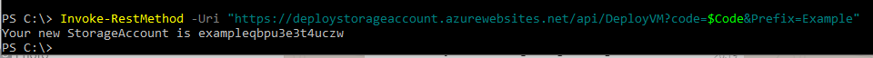

# DeployStorageAccount
Deploy a storage account through an Azure Function

## functionality

This function is called on by a http trigger. This can be done through a webbrowser or as a call in for example PowerShell.

The prefix for the storage account needs to be passed through in the URI. A random string will be attached to the storage account name.

A storage account will be created in a dedicated Resource Group. Although this storage account could be created by PowerShell alone, the point in this function is that it is possible to create resources with ARM Templates stored within the function.
(this does mean the function account is no longer stateless, so it is not build according to best practices)

```PowerShell
Invoke-RestMethod -Uri "https://[storageaccountname].azurewebsites.net/api/DeployResource?code=[Code]&Prefix=Example"

Your new StorageAccount is exampleqbpu3e3t4uczw
```



## Deployment

The function app can be deployed in your preferred way. It is important to note that it needs a managed Identity and permissions to create resources.

To help accomplish this, the script "set-Permissions" can be used. If the name of the storage app is entered there, it will create the identity and give it contributor permissions on the subscription.
For more granular permissions, please add those manually.
